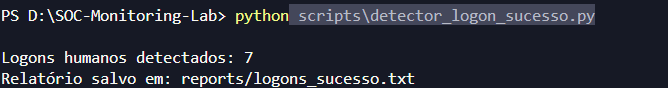
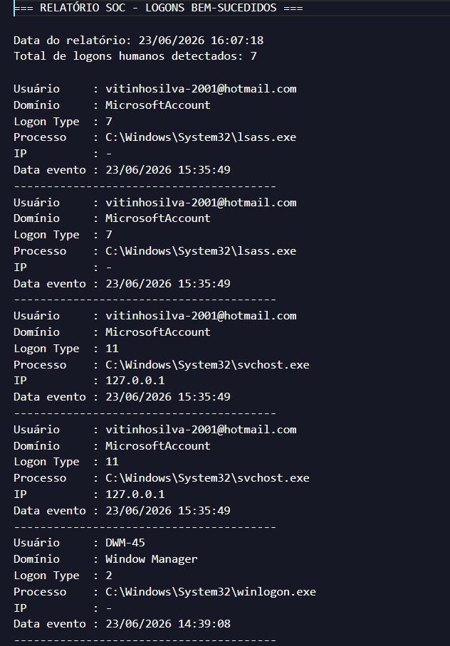
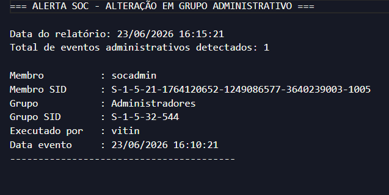
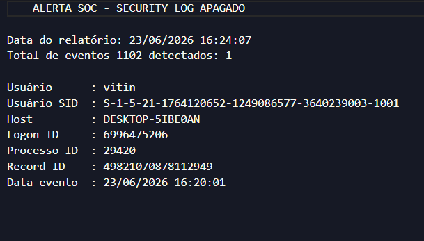
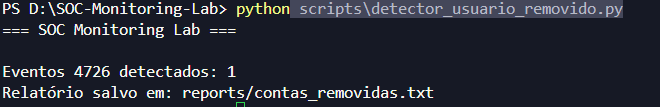
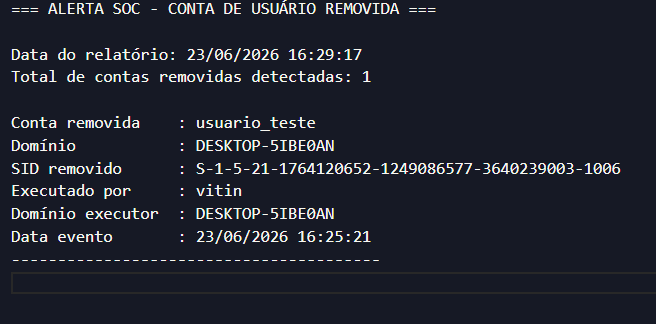

# SOC Monitoring Lab

Laboratório prático de monitoramento de segurança baseado em logs reais do Windows Security Log.

O projeto simula atividades realizadas por um Analista SOC L1, utilizando eventos de auditoria do Windows para identificar falhas de autenticação, criação e remoção de usuários, alterações em grupos, logons bem-sucedidos e possíveis tentativas de ocultação de rastros.

---

## Objetivo

Demonstrar habilidades práticas de:

* Monitoramento de eventos de segurança
* Investigação de logs do Windows
* Análise de atividades suspeitas
* Detecção de alterações administrativas
* Geração automatizada de relatórios SOC
* Automação de tarefas Blue Team com Python

---

## Tecnologias Utilizadas

* Python 3
* PowerShell
* Windows Event Viewer
* Windows Security Logs
* Git e GitHub


---


## Arquitetura do Laboratório

O laboratório utiliza eventos reais do Windows Security Log para simular atividades de monitoramento executadas por um Analista SOC.

```text
Windows Security Logs
          ↓
      Event Viewer
          ↓
     Python Scripts
          ↓
     SOC Reports
          ↓
     Investigação
```

Fluxo de análise:

1. O Windows registra eventos de segurança.
2. Os scripts Python coletam os eventos relevantes.
3. Os dados são processados automaticamente.
4. Relatórios SOC são gerados.
5. Os eventos são investigados e documentados.

---

## Casos de Uso Investigados

### Brute Force Detection

Monitoramento de falhas de autenticação utilizando Event ID 4625.

Objetivos:

* Detectar múltiplas tentativas de login
* Identificar usuários alvo
* Identificar IPs de origem
* Gerar alertas automáticos

---

### User Lifecycle Monitoring

Monitoramento de criação e remoção de usuários.

Eventos utilizados:

* Event ID 4720
* Event ID 4726

Objetivos:

* Detectar contas criadas
* Detectar contas removidas
* Identificar responsáveis pelas alterações

---

### Privilege Escalation Monitoring

Monitoramento de alterações em grupos e privilégios.

Eventos utilizados:

* Event ID 4728
* Event ID 4732

Objetivos:

* Detectar adição de usuários em grupos
* Detectar inclusão em Administradores
* Identificar possíveis escalonamentos de privilégio

---

### Log Tampering Detection

Monitoramento de tentativas de ocultação de rastros.

Eventos utilizados:

* Event ID 1102

Objetivos:

* Detectar limpeza do Security Log
* Identificar usuário responsável
* Apoiar investigações pós-incidente

---

## Detectores Implementados

### detector_bruteforce.py

Detecta falhas de autenticação (4625) e gera relatórios de possíveis tentativas de brute force.

### detector_logon_sucesso.py

Detecta logons bem-sucedidos (4624) e registra atividades de autenticação válidas.

### detector_usuario_criado.py

Detecta criação de contas locais (4720).

### detector_usuario_removido.py

Detecta remoção de contas locais (4726).

### detector_grupo_privilegiado.py

Detecta alterações em grupos locais (4728).

### detector_admin_group.py

Detecta inclusão de usuários em grupos administrativos (4732).

### detector_log_cleared.py

Detecta limpeza do Security Log (1102).

---

## Mapeamento MITRE ATT&CK

| Event ID | Técnica MITRE | Categoria                |
| -------- | ------------- | ------------------------ |
| 4625     | T1110         | Brute Force              |
| 4720     | T1136         | Create Account           |
| 4726     | T1531         | Account Access Removal   |
| 4728     | T1098         | Account Manipulation     |
| 4732     | T1098         | Account Manipulation     |
| 1102     | T1070.001     | Clear Windows Event Logs |

---

## Principais Aprendizados

Durante o desenvolvimento deste laboratório foi possível aprender:

* Investigação de eventos Windows
* Interpretação de Logon Types
* Análise de Security Logs
* Automação de análises com Python
* Geração de relatórios SOC
* Monitoramento de privilégios
* Técnicas de evasão (Log Clearing)
* Fundamentos de Blue Team
* Processo de investigação de incidentes

---

## Estatísticas do Projeto

* 7 detectores implementados
* 7 tipos de eventos monitorados
* 16 screenshots documentadas
* Relatórios automatizados
* Logs reais do Windows
* Mapeamento MITRE ATT&CK
* Automação com Python e PowerShell

```
```

---


## Eventos Monitorados

| Event ID | Evento               | Descrição                                       | Status |
| -------- | -------------------- | ----------------------------------------------- | ------ |
| 4625     | Falha de Logon       | Detecta tentativas de autenticação malsucedidas | ✅      |
| 4624     | Logon Bem-Sucedido   | Detecta autenticações válidas de usuários       | ✅      |
| 4720     | Criação de Usuário   | Detecta criação de novas contas locais          | ✅      |
| 4726     | Remoção de Usuário   | Detecta exclusão de contas locais               | ✅      |
| 4728     | Alteração em Grupo   | Detecta adição de usuários a grupos locais      | ✅      |
| 4732     | Grupo Administrativo | Detecta inclusão em grupo Administradores       | ✅      |
| 1102     | Security Log Limpo   | Detecta apagamento do log de segurança          | ✅      |

---

## Cenários Monitorados

### Event ID 4625 — Falha de Autenticação

Detecta tentativas de login malsucedidas.

Informações coletadas:

* Usuário alvo
* Endereço IP
* Quantidade de tentativas
* Data e hora do evento

Objetivo SOC:

* Identificar possíveis ataques de brute force
* Detectar credenciais inválidas
* Apoiar investigação de tentativas de acesso indevido

---

### Event ID 4624 — Logon Bem-Sucedido

Detecta autenticações válidas realizadas no sistema.

Informações coletadas:

* Usuário autenticado
* Tipo de logon
* Processo responsável
* Endereço IP
* Data e hora

Objetivo SOC:

* Auditar acessos
* Investigar logons suspeitos
* Complementar análise de falhas de login

---

### Event ID 4720 — Criação de Conta de Usuário

Detecta novas contas locais criadas no Windows.

Informações coletadas:

* Conta criada
* Usuário responsável pela criação
* Domínio
* Data e hora

Objetivo SOC:

* Identificar criação de contas não autorizadas
* Detectar possível persistência em ambiente comprometido

---

### Event ID 4726 — Remoção de Conta

Detecta exclusão de contas locais.

Informações coletadas:

* Conta removida
* SID removido
* Usuário executor
* Data e hora

Objetivo SOC:

* Auditar ações administrativas
* Investigar remoção indevida de contas
* Identificar possível tentativa de apagar rastros

---

### Event ID 4728 — Alteração em Grupo

Detecta inclusão de usuários em grupos locais.

Informações coletadas:

* Usuário adicionado
* Grupo afetado
* Executor da ação
* Data e hora

Objetivo SOC:

* Monitorar alterações de permissões
* Identificar movimentações relacionadas a privilégios

---

### Event ID 4732 — Adição ao Grupo Administradores

Detecta inclusão de contas em grupos administrativos privilegiados.

Informações coletadas:

* Usuário adicionado
* Grupo administrativo
* SID do grupo
* Executor da ação
* Data e hora

Objetivo SOC:

* Detectar possível privilege escalation
* Identificar persistência administrativa
* Monitorar alterações críticas de acesso

---

### Event ID 1102 — Security Log Limpo

Detecta quando o log de segurança do Windows é apagado.

Informações coletadas:

* Usuário responsável
* SID
* Host
* Processo
* Data e hora

Objetivo SOC:

* Detectar tentativa de ocultação de rastros
* Identificar possível atividade pós-comprometimento
* Apoiar investigação de evasão

---

## Estrutura do Projeto

```text
SOC-Monitoring-Lab/
├── reports/
│   ├── alerta_bruteforce.txt
│   ├── logons_sucesso.txt
│   ├── contas_criadas.txt
│   ├── contas_removidas.txt
│   ├── grupos_privilegiados.txt
│   ├── admin_group_changes.txt
│   └── security_log_cleared.txt
│
├── screenshots/
│   ├── 01_event_overview.png
│   ├── 02_event_details.png
│   ├── 03_detector_execution.png
│   ├── 04_alert_report.png
│   ├── 05_user_creation_detector.png
│   ├── 06_user_creation_report.png
│   ├── 07_group_change_detector.png
│   ├── 08_group_change_report.png
│   ├── 09_logon_success_detector.png
│   ├── 10_logon_success_report.png
│   ├── 11_admin_group_detector.png
│   ├── 12_admin_group_report.png
│   ├── 13_log_cleared_detector.png
│   ├── 14_log_cleared_report.png
│   ├── 15_user_deleted_detector.png
│   └── 16_user_deleted_report.png
│
├── scripts/
│   ├── detector_bruteforce.py
│   ├── detector_logon_sucesso.py
│   ├── detector_usuario_criado.py
│   ├── detector_usuario_removido.py
│   ├── detector_grupo_privilegiado.py
│   ├── detector_admin_group.py
│   └── detector_log_cleared.py
│
├── .gitignore
└── README.md
```

---

## Evidências

### 1. Eventos 4625 detectados


### 2. Investigação detalhada do evento 4625


### 3. Execução do detector de brute force


### 4. Relatório de falhas de autenticação


---

## Monitoramento de Criação de Usuários — Event ID 4720

### Execução do detector


### Relatório gerado


---

## Monitoramento de Alteração em Grupos — Event ID 4728

### Execução do detector


### Relatório gerado


---

## Monitoramento de Logons Bem-Sucedidos — Event ID 4624

### Execução do detector



### Relatório gerado



---

## Monitoramento de Grupo Administrativo — Event ID 4732

### Execução do detector


### Relatório gerado



---

## Monitoramento de Security Log Apagado — Event ID 1102

### Execução do detector


### Relatório gerado



---

## Monitoramento de Remoção de Usuário — Event ID 4726

### Execução do detector



### Relatório gerado



---

## Resultados Obtidos

Durante os testes foram identificados e processados:

* Falhas de autenticação
* Logons bem-sucedidos
* Criação de contas locais
* Remoção de contas locais
* Alterações em grupos locais
* Inclusão em grupo administrativo
* Limpeza do Security Log

Todos os eventos foram coletados a partir do Windows Security Log e processados automaticamente pelos scripts Python, gerando relatórios SOC com usuários, IPs, SIDs, processos, timestamps e indicadores relevantes para investigação.

---

## Competências Demonstradas

* SOC Analysis
* Blue Team
* Windows Security Logs
* Event Viewer
* PowerShell
* Python Automation
* Log Analysis
* Threat Detection
* Incident Investigation
* Security Monitoring
* Privilege Escalation Detection
* Account Lifecycle Monitoring
* Log Tampering Detection

---

## Como Executar

Abra o PowerShell ou VS Code como Administrador.

Execute os scripts:

```powershell
python scripts\detector_bruteforce.py
python scripts\detector_logon_sucesso.py
python scripts\detector_usuario_criado.py
python scripts\detector_usuario_removido.py
python scripts\detector_grupo_privilegiado.py
python scripts\detector_admin_group.py
python scripts\detector_log_cleared.py
```

Os relatórios serão gerados automaticamente na pasta:

```text
reports/
```

---

## Roadmap

### Concluído

* [x] Event ID 4624
* [x] Event ID 4625
* [x] Event ID 4720
* [x] Event ID 4726
* [x] Event ID 4728
* [x] Event ID 4732
* [x] Event ID 1102

### Em Desenvolvimento

* [ ] Event ID 4719 (Audit Policy Changed)
* [ ] Correlação entre Event ID 4625 e 4624
* [ ] Classificação de severidade dos alertas

### Futuro

* [ ] Dashboard SOC
* [ ] Exportação CSV
* [ ] Integração com Wazuh
* [ ] Integração com MITRE ATT&CK
* [ ] Correlação avançada de eventos

```
```

---

## Status

Projeto em desenvolvimento contínuo, com foco em estudos práticos de SOC, Blue Team e análise de logs Windows.
