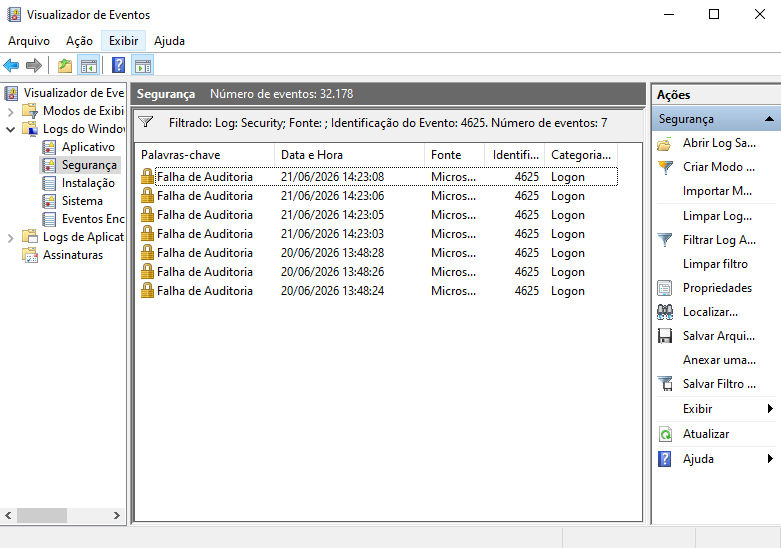
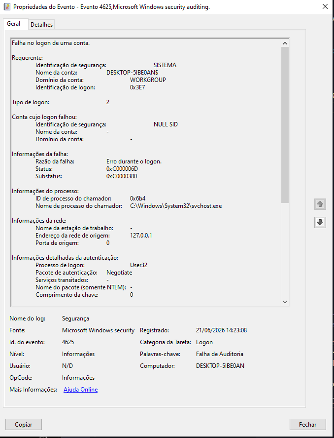
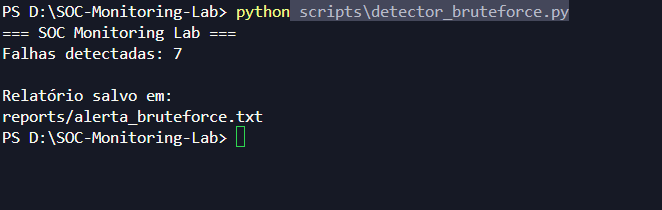
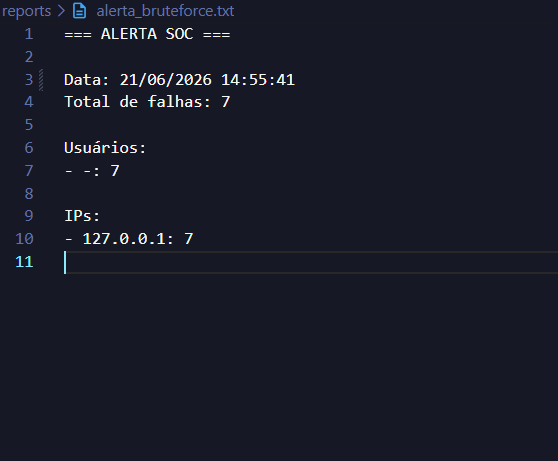
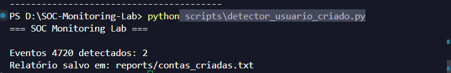
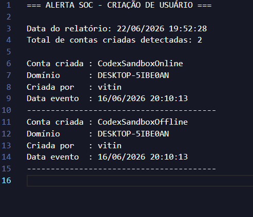
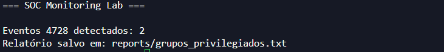
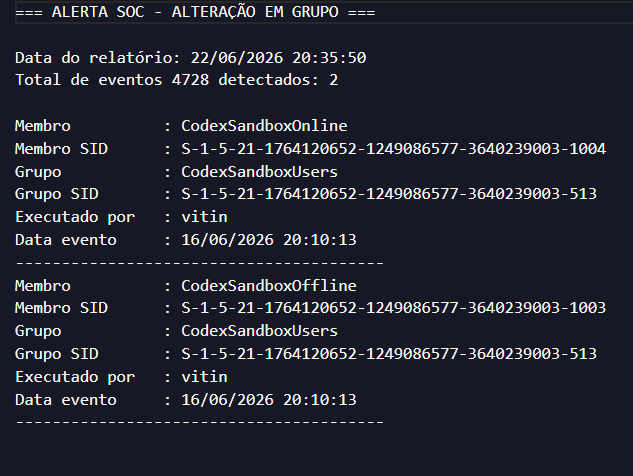

# SOC Monitoring Lab

Laboratório prático de monitoramento de segurança baseado em logs do Windows.

## Objetivo

Este projeto simula atividades realizadas por um analista SOC L1, usando logs reais do Windows para identificar falhas de autenticação, possíveis tentativas de brute force e gerar relatórios de alerta.

## Funcionalidades

- Monitoramento de falhas de autenticação (Event ID 4625)
- Monitoramento de criação de usuários (Event ID 4720)
- Monitoramento de alterações em grupos (Event ID 4728)
- Identificação de usuários envolvidos
- Identificação de IPs de origem
- Geração automática de relatórios SOC
- Investigação de eventos do Windows Security Log

## Tecnologias utilizadas

- Python
- PowerShell
- Windows Event Viewer
- Windows Security Logs

## Estrutura do projeto

```text
SOC-Monitoring-Lab/
├── logs/
reports/
 ├ alerta_bruteforce.txt
 ├ contas_criadas.txt
 └ grupos_privilegiados.txt
├── screenshots/
├── scripts/
│   └── detector_bruteforce.py
└── README.md
```

## Evidências

### 1. Eventos 4625 detectados



### 2. Investigação detalhada do evento



### 3. Execução do detector



### 4. Relatório gerado automaticamente



## Resultados

Durante os testes foram geradas múltiplas tentativas de autenticação inválidas para produzir eventos 4625 no Windows Security Log.

O detector identificou:

* 7 falhas de login
* Origem: 127.0.0.1
* Tipo de logon: 2 (logon local)

Após a análise dos eventos, foi gerado automaticamente um relatório contendo os indicadores observados.

## Monitoramento de Criação de Usuários (Event ID 4720)

O laboratório também monitora eventos de criação de contas locais no Windows.

O detector identifica:

- Usuário criado
- Domínio
- Usuário responsável pela criação
- Data e hora do evento

### Evidências

#### Execução do detector



#### Relatório gerado



## Resultados

Durante os testes foram identificadas:

- 7 falhas de autenticação (Event ID 4625)
- 2 contas criadas (Event ID 4720)

Os eventos foram processados automaticamente pelos scripts Python, gerando relatórios SOC contendo usuários, IPs, timestamps e indicadores relevantes para investigação.

## Monitoramento de Alteração em Grupos (Event ID 4728)

O laboratório monitora alterações em grupos locais do Windows para identificar possíveis elevações de privilégio e mudanças de acesso.

O detector identifica:

- Usuário adicionado ao grupo
- Grupo afetado
- Usuário responsável pela alteração
- Data e hora do evento

### Evidências

#### Execução do detector



#### Relatório gerado

