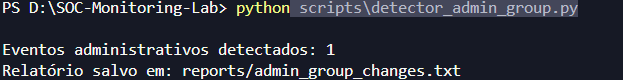
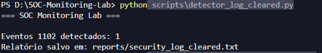

# SOC Monitoring Lab

Laboratório prático de monitoramento de segurança desenvolvido para simular atividades realizadas por um Analista SOC (Security Operations Center) utilizando eventos reais do Windows Security Log.

O projeto automatiza a coleta, análise e geração de relatórios a partir de eventos de autenticação, gerenciamento de contas, alterações administrativas e tentativas de ocultação de rastros.

---

## Sobre o Projeto

Este laboratório foi desenvolvido durante minha transição de carreira para Cibersegurança com foco em SOC Analysis e Blue Team.

O objetivo é transformar eventos reais do Windows em casos de investigação, reproduzindo atividades executadas diariamente por analistas de segurança.

Todos os cenários foram executados em ambiente local utilizando Windows Security Logs, PowerShell e Python.

---

## Visão Geral

| Área                           | Cobertura |
| ------------------------------ | --------- |
| Authentication Monitoring      | ✅         |
| User Lifecycle Monitoring      | ✅         |
| Privilege Escalation Detection | ✅         |
| Security Auditing              | ✅         |
| Log Tampering Detection        | ✅         |
| Automated Reporting            | ✅         |
| MITRE ATT&CK Mapping           | ✅         |

---

## Tecnologias Utilizadas

* Python 3
* PowerShell
* Windows Event Viewer
* Windows Security Logs
* Git
* GitHub

---

## Arquitetura do Laboratório

```text
Windows Security Logs
          ↓
      Event Viewer
          ↓
     Python Scripts
          ↓
      SOC Reports
          ↓
      Investigação
```

Fluxo:

1. O Windows registra eventos de segurança.
2. Os scripts coletam eventos relevantes.
3. Os dados são processados automaticamente.
4. Relatórios SOC são gerados.
5. Os eventos são investigados e documentados.

---

## Eventos Monitorados

| Event ID | Evento                | Objetivo                                  |
| -------- | --------------------- | ----------------------------------------- |
| 4625     | Falha de Logon        | Detectar possíveis ataques de brute force |
| 4624     | Logon Bem-Sucedido    | Auditar autenticações válidas             |
| 4720     | Criação de Usuário    | Detectar novas contas locais              |
| 4726     | Remoção de Usuário    | Auditar exclusão de contas                |
| 4728     | Alteração em Grupo    | Monitorar alterações de permissões        |
| 4732     | Grupo Administradores | Detectar privilege escalation             |
| 1102     | Security Log Limpo    | Detectar ocultação de rastros             |

---

## Casos de Uso Implementados

### Authentication Monitoring

Eventos:

* 4624
* 4625

Capacidades:

* Monitoramento de logons
* Detecção de falhas de autenticação
* Identificação de possíveis ataques de força bruta

---

### User Lifecycle Monitoring

Eventos:

* 4720
* 4726

Capacidades:

* Criação de usuários
* Remoção de usuários
* Auditoria de alterações administrativas

---

### Privilege Escalation Monitoring

Eventos:

* 4728
* 4732

Capacidades:

* Detecção de alterações em grupos
* Monitoramento de contas administrativas
* Identificação de escalonamento de privilégios

---

### Log Tampering Detection

Evento:

* 1102

Capacidades:

* Detecção de limpeza do Security Log
* Identificação de possíveis tentativas de evasão

---

## Detectores Desenvolvidos

| Script                         | Função                             |
| ------------------------------ | ---------------------------------- |
| detector_bruteforce.py         | Falhas de autenticação (4625)      |
| detector_logon_sucesso.py      | Logons bem-sucedidos (4624)        |
| detector_usuario_criado.py     | Criação de usuários (4720)         |
| detector_usuario_removido.py   | Remoção de usuários (4726)         |
| detector_grupo_privilegiado.py | Alteração de grupos (4728)         |
| detector_admin_group.py        | Inclusão em Administradores (4732) |
| detector_log_cleared.py        | Security Log apagado (1102)        |

---

## MITRE ATT&CK Mapping

| Event ID | Técnica   | Descrição                |
| -------- | --------- | ------------------------ |
| 4625     | T1110     | Brute Force              |
| 4720     | T1136     | Create Account           |
| 4726     | T1531     | Account Access Removal   |
| 4728     | T1098     | Account Manipulation     |
| 4732     | T1098     | Account Manipulation     |
| 1102     | T1070.001 | Clear Windows Event Logs |

---

## Demonstração

### Detecção de Falhas de Login


### Escalonamento de Privilégios



### Security Log Apagado



---

## Estrutura do Projeto

```text
SOC-Monitoring-Lab/

├── scripts/
├── reports/
├── screenshots/
├── README.md
└── .gitignore
```

---

## Resultados

Durante os testes foram detectados:

* Falhas de autenticação
* Logons bem-sucedidos
* Criação de usuários
* Remoção de usuários
* Alterações em grupos
* Inclusão em Administradores
* Limpeza do Security Log

Todos os eventos foram processados automaticamente e convertidos em relatórios de investigação SOC.

---

## Competências Demonstradas

* SOC Analysis
* Blue Team
* Log Analysis
* Incident Investigation
* Windows Security
* Security Monitoring
* Threat Detection
* PowerShell
* Python Automation
* Security Auditing
* Privilege Escalation Detection
* MITRE ATT&CK

---

## Como Executar

Execute os scripts como Administrador:

```powershell
python scripts\detector_bruteforce.py
python scripts\detector_logon_sucesso.py
python scripts\detector_usuario_criado.py
python scripts\detector_usuario_removido.py
python scripts\detector_grupo_privilegiado.py
python scripts\detector_admin_group.py
python scripts\detector_log_cleared.py
```

Os relatórios serão gerados automaticamente na pasta:

```text
reports/
```

---

## Roadmap

### Concluído

* [x] Event ID 4624
* [x] Event ID 4625
* [x] Event ID 4720
* [x] Event ID 4726
* [x] Event ID 4728
* [x] Event ID 4732
* [x] Event ID 1102

### Próximas Implementações

* [ ] Event ID 4719 (Audit Policy Changed)
* [ ] Correlação 4625 + 4624
* [ ] Classificação de severidade
* [ ] Dashboard SOC
* [ ] Exportação CSV
* [ ] Integração com Wazuh

---

## Status

Projeto em desenvolvimento contínuo com foco em monitoramento de segurança, Blue Team e análise de logs Windows.
